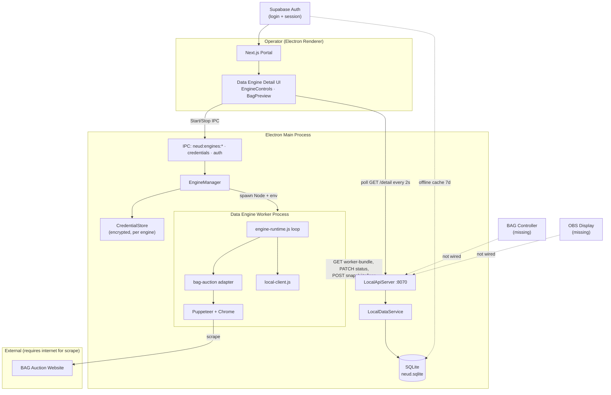

# BAG Auction Local Runtime Audit

**Date:** 2026-07-17  
**Scope:** Inspect-only audit of BAG Auction operation within the NEUD desktop architecture. No code changes were made.

**Milestone context:** Phases A (Desktop Foundation), B (SQLite local storage), and Supabase → SQLite Import Wizard are complete. This document identifies what still prevents BAG from operating **completely locally** end-to-end (scrape → operator control → OBS display).

---

## Executive Summary

BAG auction scraping **partially works locally** when running the Electron desktop app with local data enabled. The Puppeteer scraper (`bag-auction` adapter) can run as a child process, write snapshots to SQLite via the local HTTP API, and refresh the Data Engine detail UI via polling.

However, BAG is **not yet a complete local product**:

- Imported or legacy **`bag-graphics` projects cannot reach Data Engines** in the portal UI due to a project-type gate mismatch.
- **No BAG controller, OBS display, or project live-state pipeline** exists beyond a read-only preview on the Data Engine page.
- **Scraper sources and credentials must be configured manually**; local SQLite does not seed default BAG URLs.
- **Authentication still depends on Supabase** (with a 7-day offline cache that is not fully wired from the login flow).
- **Public publishing, manual mode, bid calculator, export/restore**, and most operator features from the BAG product spec are unimplemented.

---

## 1. Project Architecture

### How BAG currently operates

BAG is **not** implemented as a standalone `bag-graphics` worker or graphics module today. Instead, auction scraping runs through the generic **Webpage Scraper Data Engine** with adapter config `{ "adapter": "bag-auction" }`.

| Layer | Role | Location / notes |
|-------|------|------------------|
| **Project structure** | Portal routes under `src/app/(portal)/projects/[slug]/…`; graphic stubs under `src/graphics/bag-graphics/` (README placeholders only) | Controllers, Displays, Workers pages are placeholders |
| **Data Engine(s)** | One `webpage-scraper` engine per eligible project; config selects `bag-auction` adapter | SQLite table `data_sources`; Supabase `data_engines` in cloud mode |
| **Puppeteer scraper** | BAG-specific scrape logic | `workers/data-engine/src/adapters/bag-auction.js` |
| **Browser layer** | Launch, cookies, pages | `workers/data-engine/src/adapters/webpage-scraper/browser.js` |
| **Local API** | HTTP server on port **8070** (default); CRUD for projects, engines, snapshots, logs | `desktop/src/services/local-api-server.ts` |
| **Controller** | Operator control panel | **Not implemented** — `src/graphics/bag-graphics/controller/` is README only; portal `/controllers` is a placeholder |
| **Display** | OBS transparent browser sources | **Not implemented** — `src/graphics/bag-graphics/display/` is README only; portal `/displays` is a placeholder |
| **Worker** | Long-running Node process | `workers/data-engine/` (not `workers/bag-graphics/`, which is documentation-only) |
| **SQLite** | Local persistence | `desktop/src/database/` — projects, data sources, snapshots, logs, auth cache, import history |
| **Electron Main** | Spawns worker, credential store, engine lifecycle, local API | `desktop/src/main.ts`, `EngineManager`, IPC handlers |
| **Renderer** | Next.js portal in Electron `BrowserWindow`; polls local API in desktop mode | `EngineDetailClient`, `EngineControls`, `BagPreview` |

### Architecture diagram



### Important structural notes

1. **`bag-graphics` vs `webpage-scraper`:** Local SQLite creates a webpage-scraper engine for both project types (`LocalDataService.ensureProjectEngines`), but the portal only exposes Data Engines for `project_type === "webpage-scraper"` (`projectSupportsDataEngines` in `src/lib/data-engines/constants.ts`). Imported BAG projects with type `bag-graphics` get a 404 on Data Engine routes and no nav link.

2. **Legacy docs mismatch:** `docs/bag-graphics.md` and `workers/bag-graphics/README.md` describe a separate worker path that does not exist in code. The live scraper is the `bag-auction` adapter inside `workers/data-engine/`.

3. **Dual runtime:** The same worker codebase supports **local-desktop** (via `NEUD_LOCAL_API_URL`) and **remote-worker** (via Supabase RPC/tables). Desktop mode sets `execution_mode: "local-desktop"` in engine config.

---

## 2. Scraper Lifecycle

### What happens when the user presses **Start Engine**

Assumes desktop app, local data enabled, `execution_mode === "local-desktop"`, credentials saved, scraper source URLs configured, and engine type `webpage-scraper`.

| Step | Component | Action |
|------|-----------|--------|
| 1 | `EngineControls` | User clicks Start → `controlDesktopEngine("start")` via preload IPC (not Supabase command queue) |
| 2 | `EngineManager.start()` | Validates credentials exist; sets `execution_mode = local-desktop`; sets `desired_state = running` in SQLite |
| 3 | `EngineManager.spawnWorker()` | Spawns `workers/data-engine/src/index.js` as Node child process |
| 4 | Child env | Sets `ENGINE_ID`, `WORKER_ID`, `NEUD_LOCAL_API_URL`, `NEUD_APP_DATA_DIR`, `PUPPETEER_CACHE_DIR`, `NEUD_COOKIES_DIR`, `BAG_AUCTION_EMAIL`, `BAG_AUCTION_PASSWORD` |
| 5 | Worker boot | Loads bundle from `GET /api/data-sources/:id/worker-bundle`; writes `worker.connected` log; enters `runEngineLoop` |
| 6 | Runtime loop | `claimNextCommand` returns `null` locally; reads `desired_state === "running"` from bundle |
| 7 | Adapter start | Instantiates `bag-auction` adapter; `adapter.start()` → launches Puppeteer, runs login against configured sources |
| 8 | Scrape loop | Each poll interval: `adapter.scrapeOnce()` → `POST /snapshots`, `POST /run-success`, `POST /logs`, heartbeat via `PATCH /status` |
| 9 | UI refresh | `EngineDetailClient` polls `GET /api/data-sources/:id/detail` every **2 seconds** |

### Puppeteer launch

- **Where:** Inside the worker child process, `bag-auction.js` → `launchBrowser()` in `browser.js`.
- **Profile directory:** `{NEUD_APP_DATA_DIR}/browser-data/{engineId}` or `PUPPETEER_CACHE_DIR` (Electron sets the latter per engine).
- **Cookies:** Saved under `{NEUD_COOKIES_DIR}` via `saveCookies` / `loadCookies` in the browser layer.

### Process ownership

| Process | Owner | Lifetime |
|---------|-------|----------|
| Electron main | OS → Electron | App session |
| Data Engine worker | `EngineManager` / `ProcessManager` | From Start until Stop, crash, or app quit |
| Chrome/Chromium (Puppeteer) | Worker process | Created on adapter `start()`; closed on `stop()` / `recoverBrowser()` |

### Reconnect behavior

- **Browser failure during scrape:** `engine-runtime.js` calls `adapter.recoverBrowser()` (bag-auction resets browser) or `adapter.stop()`. Actual state becomes `error` or remains recoverable depending on `desired_state`.
- **Worker crash:** Child `exit` handler in `EngineManager` sets SQLite status to `stopped` or `error`. **No automatic respawn** unless operator presses Start again.
- **Desired state vs process:** Worker loop watches `desired_state`; if set to `stopped` while running, adapter stops and browser closes.
- **Internet / site outage:** Scrape errors logged to SQLite; status `error`/`warning`; browser may be reset. **No dedicated reconnect/backoff policy** beyond poll interval retry.

### Logs

| Destination | Content |
|-------------|---------|
| `{appData}/engine-logs/{engineId}.log` | Raw stdout/stderr from worker (credentials redacted) |
| SQLite `data_source_logs` | Structured events (`scrape.completed`, `scrape.failed`, `worker.connected`, etc.) via local API |
| Electron IPC `neud:engines:log` | Live tail to subscribed renderer windows (`EngineLogPanel` / `DesktopEnginePanel`) |
| Worker console | `[bag]` step timing and errors |

### Errors

| Destination | Content |
|-------------|---------|
| SQLite `data_source_status.last_error` | Sanitized last scrape/command error |
| SQLite `data_source_logs` | `scrape.failed`, `command.failed` with step metadata |
| Worker stderr / log file | Full stack messages (secrets redacted in IPC stream) |
| UI | `EngineHealthBadge`, `ControlDiagnostics`, desktop error messages from IPC |

### Shutdown

- **Stop button:** `EngineManager.stop()` → `desired_state = stopped` → `ProcessManager.stop()` sends SIGTERM to worker → worker loop stops adapter → browser closed.
- **App quit:** `EngineManager.stopAll()` (wired from main shutdown).
- **Run Once while stopped:** Queues run-once flag; spawns worker if needed; after one scrape, adapter stops if `desired_state` remains `stopped`.

### Restart

- **Restart button:** `EngineManager.restart()` = `stop()` then `start()` (new worker process, full browser relaunch and re-login).
- **Adapter-level:** `bag-auction.restart()` resets browser and calls `start()` again (used when remote command queue path handles restart commands; locally commands are no-ops).

---

## 3. Data Flow

### One complete update (local-desktop path)

```
BAG Auction Website
        ↓  HTTPS (Puppeteer navigation/DOM)
Puppeteer (Chrome in worker process)
        ↓  DOM parse + in-memory cache merge
bag-auction adapter (scrapeOnce)
        ↓  JavaScript object (BagSnapshotData shape)
engine-runtime.js
        ↓  POST /api/data-sources/:id/snapshots
local-client.js → LocalApiServer
        ↓  LocalDataService.recordSnapshot()
SQLite (data_source_snapshots.data_json)
        ↓  GET /api/data-sources/:id/detail (poll 2s)
EngineDetailClient state
        ↓  React render
BagPreview (read-only operator preview)
        ↓  ✗ no further pipeline today
Controller  — NOT IMPLEMENTED
Display     — NOT IMPLEMENTED
```

### Snapshot payload shape (`BagSnapshotData`)

Fields written by the scraper: `prev`, `current`, `next[]`, `lots[]`, `lastSold`, `auctionDisplay`, `updatedAt`.

### Steps still touching Supabase (when not in full local mode)

| Step | Supabase usage | Local mode bypass |
|------|----------------|-------------------|
| User login | Supabase Auth session | Offline auth cache in SQLite (`auth_cache`) after `storeVerifiedSession` — **IPC exists but web login does not call it yet** |
| Project/engine reads (hosted portal) | Postgres + RLS | `NEUD_USE_LOCAL_DATA=1` → local API |
| Engine control (hosted) | `data_engine_commands` queue + Realtime | Desktop IPC + `desired_state` |
| Worker (remote) | Supabase RPC, heartbeat, snapshots | `NEUD_LOCAL_API_URL` → local API |
| Realtime UI updates | Supabase Realtime channels | 2s polling via `localGetEngineDetail` |
| Members / admin | Supabase | Not migrated to local |

**In a correctly configured desktop session with local data flags, scrape → SQLite → Engine UI does not require Supabase.** Login and initial project import still do.

---

## 4. Local Storage

### BAG-related objects persisted locally (SQLite + filesystem)

| Object | Storage | Table / path | Notes |
|--------|---------|--------------|-------|
| **Projects** | SQLite | `projects`, `project_settings` | Includes `project_type`, `display_token`, branding |
| **Engines (Data Sources)** | SQLite | `data_sources` | `config_json`: `{ adapter: "bag-auction", execution_mode: "local-desktop" }` |
| **Engine settings** | SQLite | `data_source_settings` | Poll interval, headless, detail TTL |
| **Scraper sources** | SQLite | `data_source_sources` | login, vehicles, auction-display URLs — **not auto-seeded** |
| **Engine status** | SQLite | `data_source_status` | actual_state, health, heartbeat, last_error, run counts |
| **Snapshots** | SQLite | `data_source_snapshots` | Full BAG JSON per scrape; retention pruned to **100** recent |
| **Logs** | SQLite | `data_source_logs` | Retention pruned to **500** |
| **Credentials** | Encrypted filesystem | `CredentialStore` under app data | BAG email/password per engine — **not in SQLite** |
| **Auth cache** | SQLite + encrypted file | `auth_cache` | 7-day offline window |
| **Import history** | SQLite | `import_history` | Supabase import wizard audit trail |
| **App settings** | SQLite | `app_settings` | Host ID, server config |
| **Controllers** | SQLite schema only | `controllers`, `controller_settings` | **No BAG rows or UI** |
| **Displays** | SQLite schema only | `displays`, `display_settings` | **No BAG rows or UI** |
| **Publishing** | SQLite schema only | `publishing_targets`, `publishing_sessions` | **PublishingManager is a stub** |
| **Assets** | SQLite schema only | `assets` | Not used for BAG |
| **Browser profile** | Filesystem | `{appData}/browser-data/{engineId}` | Puppeteer user data |
| **Cookies** | Filesystem | `{appData}/cookies/` | Session persistence between runs |
| **Worker log file** | Filesystem | `{appData}/engine-logs/{engineId}.log` | Raw process output |
| **Backups** | Filesystem | Created by import service | SQLite backup before import |

### In-memory only (lost on worker stop / crash)

| Object | Location | Impact |
|--------|----------|--------|
| **`detailsCache`** | `bag-auction.js` Map | Detail page scrape cache; rebuilt on next run |
| **`cache` object** | `bag-auction.js` | Current prev/current/next/lots assembly between poll ticks within a session |
| **Puppeteer pages/browser** | Worker process | Must re-login after restart |
| **EngineManager log buffer** | Electron main | Last 500 IPC log lines per engine |
| **EngineDetailClient React state** | Renderer | Refreshed from poll / initial SSR |
| **Command queue** | N/A locally | `claimNextCommand` always returns null — control is via `desired_state` only |
| **Project live state for graphics** | N/A | No table or service merges snapshot into controller/display state |

---

## 5. Runtime Dependencies

| Dependency | Used for | Classification |
|------------|----------|----------------|
| **Supabase Auth** | Portal login, session, `getUser()` in EngineControls | **Required** today for first sign-in; offline cache partially mitigates |
| **Supabase Postgres** | Hosted portal projects, engines, commands, snapshots | **Can remove later** for desktop-only operators (local path exists) |
| **Supabase Realtime** | Engine detail live updates in cloud mode | **Can remove now** when `NEUD_USE_LOCAL_DATA=1` (polling replaces it) |
| **Remote worker execution** | Cloud-hosted scrape on separate host | **Can remove later** for desktop-only deployment; still in codebase |
| **Command queue (`data_engine_commands`)** | Start/stop/restart in cloud mode | **Can remove now** for local-desktop path (desired_state + IPC) |
| **Internet (auction site)** | Puppeteer scrape target | **Required** for live auction data |
| **Internet (Supabase)** | Login, import wizard preview/execute | **Required** for auth and migration; not for scrape loop once local |
| **Chrome/Chromium** | Puppeteer (`CHROME_EXECUTABLE_PATH` optional) | **Required** |
| **Local HTTP API (8070)** | Worker ↔ SQLite bridge | **Required** for desktop runtime |
| **Electron main process** | Spawn/monitor worker, credentials | **Required** for desktop runtime |
| **Polling (2s UI, N ms scrape)** | Engine detail refresh; scrape interval | **Required** today; WebSocket not implemented |
| **Hosted APIs (Vercel Next.js)** | Portal UI | **Required** for current desktop shell (loads dev/prod Next server) |
| **Legacy `workers/bag-graphics/` docs** | Documentation only | **Can remove now** (misleading; replace with accurate paths) |
| **Legacy Supabase worker client** | `workers/data-engine/src/supabase.js` | **Can remove later** when remote-worker mode retired |
| **Public publishing / relay** | Phase E | **Can remove later** — stub only |

---

## 6. Local API Audit

Base URL: `http://127.0.0.1:8070` (configurable via desktop server config).

### BAG-relevant endpoints

| Method | Path | Purpose | Primary consumer | Data returned | Gaps |
|--------|------|---------|------------------|---------------|------|
| GET | `/api/health` | Liveness | Portal local mode check | `{ ok, service }` | — |
| GET | `/api/runtime/status` | Desktop runtime info | Settings / diagnostics | auth status, data dir | — |
| GET | `/api/projects` | List projects | Portal project list | `projects[]` | No BAG-specific filtering |
| POST | `/api/projects` | Create project | New project form | `project` | Creates engine for bag-graphics/webpage-scraper types |
| GET | `/api/projects/:slug` | Project by slug | Project layout | `project` | — |
| GET | `/api/projects/:slug/data-sources` | List engines | Data Engines index | `engines[]` with status/settings | — |
| GET | `/api/data-sources/:id` | Engine record | Queries | `engine` | — |
| GET | `/api/data-sources/:id/detail` | Full engine dashboard bundle | `EngineDetailClient` poll | engine, status, settings, sources, snapshots, logs | No separate “live state” for graphics |
| GET | `/api/data-sources/:id/worker-bundle` | Worker config + enabled sources | Data Engine worker | engine, settings, sources, status, pendingRunOnce | Credentials **not** included (env vars only) |
| PATCH | `/api/data-sources/:id/desired-state` | Start/stop intent | EngineManager / portal actions | `{ ok }` | — |
| PATCH | `/api/data-sources/:id/execution-mode` | local-desktop vs remote-worker | EngineManager | `{ ok }` | — |
| POST | `/api/data-sources/:id/run-once` | Queue single scrape | EngineManager / controls | `{ ok }` | — |
| POST | `/api/data-sources/:id/run-once/consume` | Worker consumes run-once flag | Worker loop | `{ pending }` | — |
| PATCH | `/api/data-sources/:id/settings` | Scraper settings | EngineSettingsForm | `{ ok }` | — |
| POST | `/api/data-sources/:id/sources` | Create/update scraper source | SourceList | `source` | No bulk seed endpoint |
| PATCH | `/api/data-sources/:id/sources/:sourceId` | Toggle source | SourceList | `{ ok }` | — |
| DELETE | `/api/data-sources/:id/sources/:sourceId` | Remove source | SourceList | `{ ok }` | — |
| PATCH | `/api/data-sources/:id/status` | Heartbeat / state | Worker | `{ ok }` | — |
| POST | `/api/data-sources/:id/snapshots` | Persist scrape result | Worker | `snapshot` | No GET-by-id route (detail bundle only) |
| POST | `/api/data-sources/:id/logs` | Append log | Worker | `log` | No SSE/WebSocket log stream |
| POST | `/api/data-sources/:id/run-success` | Run metrics | Worker | `{ ok }` | — |
| POST | `/api/data-sources/:id/run-failure` | Run failure metrics | Worker | `{ ok }` | — |
| POST | `/api/backup/create` | SQLite backup | Settings UI | `{ backupPath }` | Requires auth |
| POST | `/api/import/supabase/preview` | Import wizard | Settings UI | preview payload | Requires auth + Supabase |
| POST | `/api/import/supabase/execute` | Import wizard | Settings UI | import result | Requires auth + Supabase |

### Missing endpoints for full local BAG operation

- Project **live state** read/write (controller overrides, ticker, manual mode)
- **Controller** and **display** configuration and serving
- **Display URL** / tokenized public read (local OBS source)
- **WebSocket** or SSE for display refresh
- **Auction export/import** (JSON/CSV) and restore
- **Lot history** queries
- **Operator status** aggregation
- Engine **auto-start on boot** trigger from main process
- Default **BAG source seed** endpoint

---

## 7. Display Pipeline

### Current behavior

| Concern | Status |
|---------|--------|
| **HTML displays** | Not implemented. `src/graphics/bag-graphics/display/` contains README only. |
| **JSON API for graphics** | Only via latest snapshot inside `GET …/detail` — not exposed as a display-facing contract. |
| **WebSocket** | Not implemented. |
| **Controller** | Placeholder page only. No BAG operator UI. |
| **Display** | Placeholder page only. No OBS URLs. |
| **Refresh behavior** | Data Engine UI polls SQLite every **2s**. No push to external displays. |
| **BagPreview** | Read-only subset of snapshot fields on the Data Engine page — not suitable for broadcast. |
| **`display_token` on project** | Stored in SQLite/Supabase but **unused** for local serving. |
| **PublishingManager** | Returns error: “Public publishing is planned for Phase E.” |

### Cloud dependency for graphics

**Entire display pipeline is absent locally.** Even with a running scraper, there is no path from SQLite snapshot → OBS browser source except manual copy/paste of JSON from the developer drawer.

---

## 8. Failure Modes

| Scenario | Current behavior | Desired behavior (product direction) |
|----------|------------------|--------------------------------------|
| **Internet disconnect** | Scrape fails; error logged; status `error`/`warning`; preview stalls. Offline auth works within 7-day window if previously verified. | Graceful degradation: show last good snapshot on controller/display; clear operator messaging; auto-resume when online. |
| **Scraper disconnect** (browser crash) | `recoverBrowser()` resets browser; may enter `error` state; operator must often Stop/Start. | Automatic reconnect with backoff; preserve last snapshot; operator status panel. |
| **Auction website unavailable** | Scrape step errors (`login`, `vehicles`, etc.); logged with step name. | Retry policy; manual mode fallback; operator alert. |
| **Worker crash** | Process exit recorded in SQLite; engine shows stopped/error; **no auto-restart**. | Optional auto-restart when `desired_state === running`; crash notifications. |
| **Desktop restart** | Engines not auto-started (`auto_start` defaults false; no boot hook). Operator must Start again. Credentials and SQLite persist. | Configurable auto-start; restore last auction state. |
| **Power loss** | Same as desktop restart; SQLite may recover via WAL unless corrupted. | Same as restart + data integrity checks. |
| **Missing SQLite** | App fails to initialize local data / migrations. | Clear error UI; recovery from backup. |
| **Expired auth** | `AuthLicenseManager` locks app (`mode: locked`); import/backup API returns 401. Scraper may still run if already started. | Re-auth flow; distinguish “locked portal” vs “engine keeps running”. |
| **`bag-graphics` project type** | Data Engines nav hidden; routes 404. Engine may exist in DB from import but is unreachable. | `bag-graphics` projects expose the same engine UI or redirect transparently. |

---

## 9. Missing Features

Prioritized checklist (identification only — **do not implement in this audit**).

### P0 — Blocks any local BAG end-to-end use

- [ ] **Fix `bag-graphics` → Data Engine access** (`projectSupportsDataEngines` / nav / authorization)
- [ ] **Default BAG scraper source seeding** (login, vehicles, auction-display URLs) on engine creation/import
- [ ] **Wire desktop auth cache** from Supabase login (`storeVerifiedSession` IPC unused in web app)
- [ ] **BAG controller** (operator panel)
- [ ] **BAG OBS displays** (transparent HTML overlays)
- [ ] **Project live state layer** (bridge snapshots + manual overrides to controller/display)

### P1 — Core operator workflow

- [ ] **Manual Mode** (scraper off, operator-driven state)
- [ ] **Manual bid entry**
- [ ] **Bid calculator**
- [ ] **Previous / Next lot** controls
- [ ] **Manual overrides** (lot, title, bid, sold status)
- [ ] **Ticker visibility controls**
- [ ] **Operator status panel** (connection, last update, errors)
- [ ] **Reconnect logic** (worker auto-restart, browser recovery policy)

### P2 — Data management

- [ ] **Auction cache** (structured local lot store beyond raw snapshots)
- [ ] **Local lot history**
- [ ] **Automatic snapshots** (checkpointing beyond scrape retention)
- [ ] **Download auction JSON**
- [ ] **Download CSV**
- [ ] **Restore auction** from export

### P3 — Platform polish

- [ ] **Engine auto-start on desktop boot**
- [ ] **Workers project page** (real status, not placeholder)
- [ ] **Display URL copy for OBS** (local server)
- [ ] **Offline operation** without Supabase (extended auth, no import requirement)
- [ ] **Public publishing** (Phase E relay)

---

## 10. Technical Debt

| Category | Examples | Remediation timing |
|----------|----------|-------------------|
| **Dead / placeholder code** | `src/graphics/bag-graphics/**` README stubs; `workers/bag-graphics/`; Controllers/Displays/Workers placeholder pages | Remove or replace when real modules land |
| **Legacy Supabase runtime** | `workers/data-engine/src/supabase.js`; command RPC path; Realtime subscriptions in `EngineDetailClient` | Keep until remote-worker mode retired |
| **Duplicate logic** | Dual data paths (`src/lib/data-engines/queries` vs `src/lib/local/api` + portal branching); Supabase vs SQLite engine creation | Consolidate behind local-first abstractions |
| **Temporary workarounds** | `desired_state` drives local control while cloud uses command queue; `shouldUseLocalDesktopEngine` requires desktop + local-desktop mode | Unify control model |
| **Documentation drift** | `docs/bag-graphics.md` claims scraper not implemented; points to wrong worker path | Update when scraper path stabilizes |
| **Misleading project types** | `bag-graphics` creates engines locally but portal blocks access | Fix gate or merge types |
| **Unused schema** | `controllers`, `displays`, `publishing_*`, `assets` tables empty | Populate or defer migration |
| **Auth IPC unwired** | Preload exposes `storeVerifiedSession`; no portal caller | Wire on successful Supabase login |
| **Import without sources** | Import wizard may not map Supabase scraper sources → local `data_source_sources` | Verify import normalizer coverage |
| **Retention-only history** | Snapshots capped at 100 rows — not a full auction archive | Replace with explicit auction store |

### Code safe to remove **after** BAG is fully local

- Remote-worker execution mode and Supabase worker client (if desktop-only deployment chosen)
- Supabase Realtime branches in engine UI
- Cloud command queue actions for engines when running in Electron
- Placeholder README trees replaced by real implementations

---

## 11. Recommended Implementation Order

Adjusted from the expected direction based on codebase blockers:

| Order | Task | Rationale |
|-------|------|-----------|
| **1** | **Unblock `bag-graphics` Data Engine access** | Imported BAG projects are unusable in UI today despite SQLite engines existing |
| **2** | **Seed/configure default BAG scraper sources + credential UX** | Engine starts fail without manual URL setup; Supabase cloud seeding does not mirror locally |
| **3** | **Finish scraper lifecycle** | Auto-restart on crash, optional auto-start on boot, clearer reconnect/backoff, verify import maps sources |
| **4** | **Project live state service** | Snapshots alone are insufficient — controller/display need mutable operator state |
| **5** | **BAG controller (local)** | Operator workflow; consumes live state + snapshots |
| **6** | **BAG displays (local HTML + refresh)** | OBS browser sources reading local state/API |
| **7** | **Manual Mode + manual bid entry + overrides** | Core BAG operator features from spec |
| **8** | **Bid calculator + Previous/Next lot** | Depends on controller + live state |
| **9** | **Persist auction data locally** (lot history, cache beyond 100 snapshots) | Export/import foundation |
| **10** | **Export auction JSON/CSV + restore** | Backup and replay |
| **11** | **Wire offline auth completely** | Reduce Supabase dependency for day-to-day ops |
| **12** | **Offline operation hardening** | Internet loss, site outage, worker recovery UX |
| **13** | **Public publishing (Phase E)** | Optional outward-facing displays |

---

## Appendix A — Files Inspected

### Desktop / Electron

- `desktop/src/main.ts`
- `desktop/src/services/engine-manager.ts`
- `desktop/src/services/local-api-server.ts`
- `desktop/src/services/local-data-service.ts`
- `desktop/src/services/auth-license-manager.ts`
- `desktop/src/services/publishing/publishing-manager.ts`
- `desktop/src/services/credential-store.ts` (referenced)
- `desktop/src/repositories/data-sources-repository.ts`
- `desktop/src/database/migrations/001_initial_schema.sql`
- `desktop/src/database/migrations/002_import_history.sql`
- `desktop/src/ipc/engines.ts`
- `desktop/src/ipc/auth.ts`
- `desktop/src/preload.ts`

### Worker / scraper

- `workers/data-engine/src/index.js`
- `workers/data-engine/src/engine-runtime.js`
- `workers/data-engine/src/local-client.js`
- `workers/data-engine/src/commands.js`
- `workers/data-engine/src/adapters/bag-auction.js`
- `workers/data-engine/src/adapters/webpage-scraper/browser.js`
- `workers/data-engine/src/adapters/registry.js`
- `workers/bag-graphics/README.md`

### Portal / UI

- `src/components/data-engines/EngineDetailClient.tsx`
- `src/components/data-engines/webpage-scraper/EngineControls.tsx`
- `src/components/data-engines/webpage-scraper/DesktopEnginePanel.tsx`
- `src/components/data-engines/webpage-scraper/BagPreview.tsx`
- `src/components/projects/ProjectNav.tsx`
- `src/app/(portal)/projects/[slug]/controllers/page.tsx`
- `src/app/(portal)/projects/[slug]/displays/page.tsx`
- `src/app/(portal)/projects/[slug]/workers/page.tsx`
- `src/app/(portal)/projects/[slug]/data-engines/page.tsx`
- `src/app/(portal)/projects/[slug]/data-engines/[engineId]/page.tsx`

### Libraries / types / docs

- `src/lib/data-engines/constants.ts`
- `src/lib/data-engines/types.ts`
- `src/lib/data-engines/authorization.ts`
- `src/lib/desktop/client.ts`
- `src/lib/local/api.ts`
- `src/lib/local/mode.ts`
- `src/lib/projects/constants.ts`
- `src/graphics/bag-graphics/README.md`
- `docs/bag-graphics.md`
- `supabase/migrations/004_data_engines.sql` (partial)

---

## Appendix B — Architecture Diagram (ASCII)

```
┌─────────────────────────────────────────────────────────────────┐
│                     Electron Renderer (Next.js)                  │
│  ProjectNav · EngineControls · EngineDetailClient · BagPreview     │
└───────────────┬───────────────────────────────┬─────────────────┘
                │ IPC                           │ HTTP :8070 poll
                ▼                               ▼
┌───────────────────────────┐       ┌─────────────────────────────┐
│     Electron Main         │       │      LocalApiServer          │
│  EngineManager            │◄──────│  LocalDataService            │
│  CredentialStore          │       └──────────────┬──────────────┘
│  AuthLicenseManager       │                      │
└─────────────┬─────────────┘                      ▼
              │ spawn                         ┌─────────┐
              ▼                               │ SQLite  │
┌───────────────────────────┐                 └─────────┘
│  workers/data-engine      │
│  engine-runtime + bag-    │
│  auction + Puppeteer      │
└─────────────┬─────────────┘
              │ HTTPS
              ▼
      ┌───────────────┐
      │ BAG Auction   │
      │ Website       │
      └───────────────┘

  [ MISSING: Controller ] [ MISSING: OBS Display ]
```

---

## Appendix C — Remaining Blockers

1. **`bag-graphics` project type cannot open Data Engines** in the portal (critical for imported BAG projects).
2. **No controller or OBS display pipeline** — scraping data stops at `BagPreview`.
3. **Scraper sources not seeded locally** — operator must manually configure URLs before Start succeeds.
4. **Auth still requires Supabase** for initial login; desktop offline cache IPC not wired from web login.
5. **No project live state** — manual mode, overrides, and ticker cannot exist without new storage/API.
6. **Worker does not auto-restart** on crash or desktop reboot.
7. **Publishing / public display URLs** not implemented.

---

## Appendix D — Risk Assessment

| Risk | Severity | Likelihood | Notes |
|------|----------|------------|-------|
| Imported BAG projects appear “broken” (no Data Engines nav) | **High** | **High** | Type gate mismatch |
| Operator configures wrong/missing URLs → engine errors | **High** | **Medium** | No local seed defaults |
| Worker crash during live auction | **High** | **Medium** | Manual Start required; no auto-recover |
| Auth expiry mid-event locks settings/import but not running engine | **Medium** | **Low** | Inconsistent UX |
| Snapshot retention (100) loses auction history | **Medium** | **High** | By design today |
| Dual runtime (local + Supabase) regression | **Medium** | **Medium** | Branching complexity |
| Credential storage compromise on shared machine | **Medium** | **Low** | Encrypted store; env injection to worker |
| Documentation leads devs to wrong worker path | **Low** | **High** | `workers/bag-graphics` vs `data-engine` |

---

## Appendix E — Recommended Next Implementation Task

**Task:** Unblock `bag-graphics` projects from accessing the Data Engine UI and routes (align `projectSupportsDataEngines`, `ProjectNav`, and `requireDataEnginesProject` with local SQLite behavior that already creates engines for `bag-graphics`).

**Follow immediately with:** Default BAG scraper source seeding on local engine creation/import so Start Engine succeeds without manual URL entry.

This unlocks the existing scrape → SQLite → preview path for real BAG projects and is prerequisite work before controller/display implementation.
